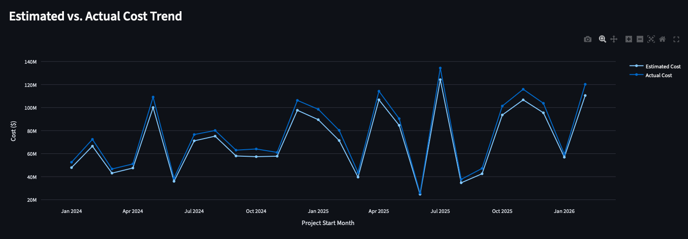
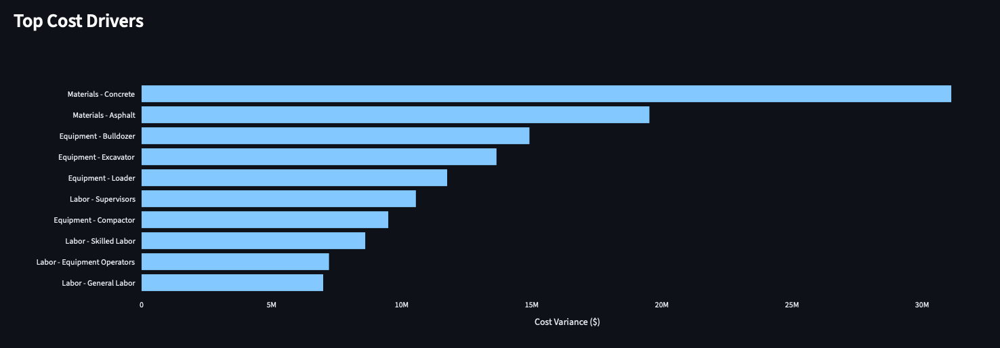
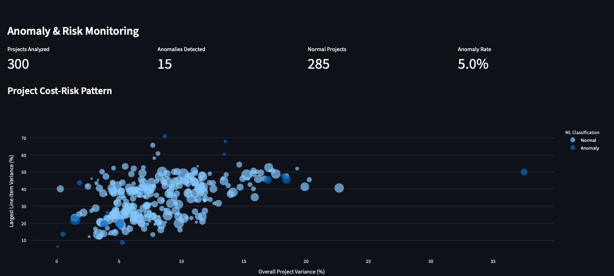

# 🏗️ Construction Cost Intelligence Dashboard

An end-to-end construction cost analytics project that compares estimated project costs with actual costs, identifies budget overruns, analyzes cost drivers, and uses machine learning to detect unusual project cost behavior.

The project demonstrates a complete analytics workflow using **Python, SQL, SQLite, Streamlit, Plotly, and scikit-learn**.

---
## 📸 Dashboard Preview

### Executive Dashboard


### Cost Analysis



### Cost Driver Analysis



### Machine Learning Anomaly Detection




## 📌 Project Overview

Construction projects often experience differences between originally estimated costs and actual costs incurred during execution.

This project simulates a construction cost-management environment where project estimates are compared with actual expenses across categories such as:

* Labor
* Materials
* Equipment
* Fuel
* Subcontractors

The dashboard allows users to investigate cost performance from the portfolio level down to individual projects and cost components.

---

## 🎯 Business Questions

The project is designed to answer questions such as:

* Which projects are over budget?
* What is the total estimated cost versus actual cost?
* Which projects have the largest cost overruns?
* Which cost categories contribute most to variance?
* Which specific cost components are driving overruns?
* Are overruns more associated with quantity usage or unit-cost increases?
* How does project cost performance change over time?
* Which projects show unusual cost behavior compared with the rest of the portfolio?

---

## 📊 Dashboard Features

### Executive KPIs

The dashboard displays:

* Total Estimated Cost
* Total Actual Cost
* Total Cost Variance
* Overall Variance Percentage
* Number of Projects
* Number of Cost Categories
* Number of Cost Records

---

### Project Budget Status

Projects are classified into four categories based on total project cost variance:

| Status       | Rule                        |
| ------------ | --------------------------- |
| Over Budget  | Variance > 10%              |
| Watch        | Variance > 5% and ≤ 10%     |
| On Budget    | Variance between -5% and 5% |
| Under Budget | Variance < -5%              |

---

### Estimated vs. Actual Cost Analysis

The dashboard compares estimated and actual costs across major construction cost categories.

This helps identify areas where actual spending consistently exceeds estimates.

---

### Top Projects by Cost Overrun

Projects are ranked by:

```text
Cost Variance = Actual Cost - Estimated Cost
```

This allows management to quickly identify projects with the largest dollar overruns.

---

### Cost Driver Analysis

The dashboard drills into individual cost components such as:

* Concrete
* Asphalt
* Gravel
* Excavators
* Bulldozers
* Loaders
* Diesel
* Skilled Labor
* Equipment Operators
* Subcontractor Work

This helps determine which components contribute most to portfolio cost variance.

---

### Quantity vs. Unit-Cost Analysis

Cost overruns may result from:

1. Using more material, labor, equipment, or fuel than expected
2. Paying a higher unit price than expected

The project separately calculates:

```text
Quantity Variance %
```

and

```text
Unit-Cost Variance %
```

to help distinguish these patterns.

---

### Project Drill-Down

Users can select an individual project and view:

* Estimated Cost
* Actual Cost
* Cost Variance
* Variance Percentage
* Project Budget Status
* Cost-category breakdown
* Cost-component breakdown

This supports analysis from:

```text
Portfolio
   ↓
Project
   ↓
Category
   ↓
Cost Component
```

---

### Cost Trend Analysis

Projects are grouped by their project start month to compare estimated and actual project costs over time.

This provides a high-level view of how cost performance changes across project cohorts.

---

### Executive Insights

The dashboard automatically identifies:

* Largest project overrun
* Largest dollar cost driver
* Highest percentage-variance category
* Primary quantity-vs-unit-cost variance pattern

These insights update when dashboard filters change.

---

## 🤖 Machine Learning — Anomaly Detection

The project includes an unsupervised machine-learning model using:

**Isolation Forest**

from `scikit-learn`.

The model identifies projects whose cost behavior differs significantly from the rest of the portfolio.

### Features used by the model

* Overall Project Variance %
* Average Quantity Variance %
* Average Unit-Cost Variance %
* Maximum Cost-Line Variance %

The model labels projects as:

```text
Normal
```

or

```text
Anomaly
```

Anomaly detection is used as an investigation and prioritization signal rather than as a prediction that a project will fail.

---

## 🧮 Core Metrics

### Cost Variance

```text
Cost Variance = Actual Cost - Estimated Cost
```

### Cost Variance Percentage

```text
Variance % =
(Actual Cost - Estimated Cost)
-------------------------------- × 100
        Estimated Cost
```

### Quantity Variance

```text
Quantity Variance =
Actual Quantity - Estimated Quantity
```

### Unit-Cost Variance

```text
Unit-Cost Variance =
Actual Unit Cost - Estimated Unit Cost
```

---

##  Technology Stack

### Programming

* Python
* Pandas
* NumPy

### Database

* SQLite
* SQL

### Machine Learning

* scikit-learn
* Isolation Forest

### Visualization

* Streamlit
* Plotly

### Development Tools

* Visual Studio Code
* Git
* GitHub
* GitHub Desktop

---

## 🗂️ Project Structure

```text
construction-cost-intelligence/
│
├── data/
│   ├── raw/
│   │   ├── projects.csv
│   │   ├── cost_codes.csv
│   │   ├── estimates.csv
│   │   ├── actual_costs.csv
│   │   └── project_variance.csv
│   │
│   └── processed/
│       ├── construction_cost_analysis.csv
│       └── project_anomalies.csv
│
├── database/
│   └── construction.db
│
├── dashboard/
│   └── app.py
│
├── etl/
│   └── data_pipeline.py
│
├── ml/
│   └── anomaly_detection.py
│
├── sql/
│   └── analysis_queries.sql
│
├── notebooks/
│
├── tests/
│
├── .gitignore
├── requirements.txt
├── data_dictionary.csv
├── census_data_source.csv
└── README.md
```

---

## 🔄 Data Pipeline

The project follows this workflow:

```text
Raw CSV Data
      ↓
Data Validation
      ↓
Cleaning & Transformation
      ↓
Feature Engineering
      ↓
SQLite Database
      ↓
SQL Analysis
      ↓
Machine Learning
      ↓
Streamlit Dashboard
```

---

## 🗄️ SQL Analysis

The SQLite database contains tables for:

* Projects
* Cost Codes
* Estimates
* Actual Costs
* Processed Cost Analysis

SQL queries are used to calculate:

* Overall cost performance
* Category-level variance
* Project-level overruns
* Percentage overruns
* Budget-status distributions
* Subcategory cost drivers
* Complexity-based performance
* Location-based performance
* Quantity versus unit-cost patterns

---

## 📈 Example Portfolio Results

Across the complete synthetic dataset:

```text
Projects:               300
Cost Records:          4,500

Estimated Cost:        ~$1.84B
Actual Cost:           ~$1.99B
Cost Variance:         ~$155.02M
Overall Variance:      ~8.43%
```

Some of the largest portfolio-level cost drivers include:

```text
Materials
Equipment
Labor
Fuel
Subcontractors
```

At the subcategory level, Concrete is one of the largest dollar contributors to overall cost variance.

---

## 💻 Running the Project Locally

### 1. Clone the repository

```bash
git clone <your-github-repository-url>
```

### 2. Move into the project directory

```bash
cd construction-cost-intelligence
```

### 3. Create a Python virtual environment

```bash
python3 -m venv .venv
```

### 4. Activate the environment

On macOS:

```bash
source .venv/bin/activate
```

### 5. Install dependencies

```bash
python -m pip install -r requirements.txt
```

### 6. Run the ETL pipeline

```bash
python etl/data_pipeline.py
```

This validates the raw data, generates the processed analytical dataset, and creates the SQLite database.

### 7. Run anomaly detection

```bash
python ml/anomaly_detection.py
```

### 8. Launch the dashboard

```bash
streamlit run dashboard/app.py
```

Then open the local Streamlit URL displayed in the terminal.

---

## 📂 Dataset

The project-level construction data used in this repository is **synthetic and generated for educational and portfolio purposes**.

It is designed to reproduce realistic relationships between:

* Project characteristics
* Estimated quantities
* Estimated unit costs
* Actual quantities
* Actual unit costs
* Actual project costs
* Cost variance

The dataset does **not** contain private HeavyJob, HeavyBid, HCSS, contractor, or employer data.

Public construction-industry information may be used only as external industry context and is not presented as the source of the synthetic project-level records.

---

## 🧠 Key Analytical Takeaways

The analysis demonstrates several useful cost-management concepts:

* Dollar variance and percentage variance answer different business questions.
* A high-cost project can produce a large dollar overrun without having the highest percentage overrun.
* Cost categories should be investigated at the subcategory level to identify actionable drivers.
* Quantity deviations and unit-price deviations should be analyzed separately.
* Machine-learning anomaly detection can provide a prioritization layer for identifying unusual projects.
* Interactive filtering allows managers to analyze performance by location, project type, complexity, category, and project.

---

## 🚀 Future Improvements

Potential extensions include:

* Integrating a real construction-management API
* Adding transaction-level cost dates
* Forecasting project final cost
* Building automated variance alerts
* Adding change-order analysis
* Incorporating equipment-utilization data
* Adding bid-versus-actual historical benchmarking
* Deploying the Streamlit application online
* Adding AI-generated narrative explanations of cost variance

---

## 👤 Author

**Archana Bhusara**

M.S. Engineering Science — Data Science
University at Buffalo, SUNY

Areas of interest:

* Data Analytics
* Data Science
* Data Engineering
* Machine Learning
* Business Intelligence
